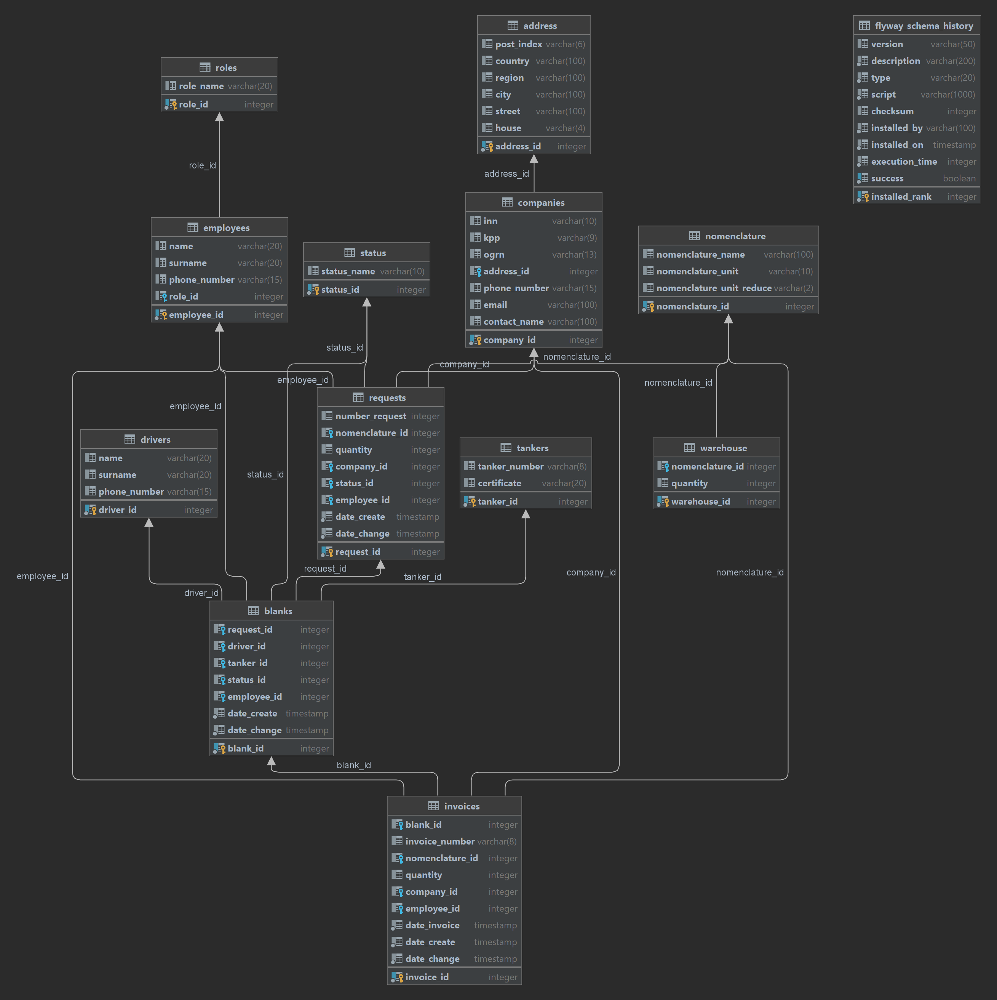

<h1 align="center">Нефтебаза</h1>
<h3 align="center">Содержание:</h3>
1. Описание приложения и функционала 
2. Запускаем приложение 
3. API взаимодействие с приложением 
4. Схема структуры базы данных
5. Использованные технологии и их версии

____
### I. Описание приложения и функционала

Перед вами сервис обработки заявок на отгрузку топлива с нефтебазы, с момента получения заявки до момента отгрузки и выставления отгрузочной накладной.
Кроме базового функционала приложения по принципу получения данных, создания, обновления, и удаления всех доступных моделей приложения: компаний и их адресов, водителей бензовозов, бензовозов, номенклатуры нефтепродуктов, складов нефтепродуктов, пользователей системы и их ролей, а также заявок, котировок и накладных и их статусы.

В приложении отсутствует система аутентификации как таковая, однако доступность тех или иных функций зависит от ролей, которые прописаны в логике приложения. По замыслу пользователь с ролью «админ» имеет доступ ко всем возможностям приложения, пользователь «завхоз», ограничен в области предоставления ролей, пользователь «оператор» должен иметь доступ только к заведению и обработке заявок, пользователь «менеджер» - имеет доступ к котировкам.

Идея работы программы:
**далее по тексту каждому объекту в скобках будет указана соответствующая ей сущность в базе данных.**
Нефтебаза(warehouse) имеет в своём наличии нефтепродукты различных номенклатур(nomenclature).
Контрагенту(company) необходимо для своих нужд получить нефтепродукты. Он по e-mail или звонку сообщает о своей потребности. Оператор(он и остальные должностные лица - employee) составляет заявку(request), когда заявка заполнена и имеет статус(status) «в ожидании», она ждёт одобрения от завхоза, только он имеет права на закрытие заявки и одновременное создание котировки. Далее вступает в работу менеджер, который уточняет детали отгрузки и заполняет все незаполненные поля котировки, переводя статус котировки «в ожидании». После чего котировка ждёт одобрения от завхоза, который в момент отгрузки товара закрывает котировку с одновременным созданием накладной(invoice). На этом можно считать цикл отгрузки завершённым.

==================
   
###  II. Запускаем приложение
1. Клонируем проект в среду разработки
2. Убедитесь что Java 17, Postgresql 16, создана новая база данных(важно!).
3. Настройки соединения с базой данных прописать в application.properties, поля url, username, password.
4. Запускаем приложение в среде разработки. При успешном запуске приложения, можно пользоваться подключенными API.

### III. API взаимодействие с приложением

1. **Работа с ролями**
   * Используемый репозиторий: [RoleDAOImpl.java]
   * Используемые сервисы: BaseService [RoleServiceImpl.java]
      
   Доступные эндпоинты: 

   1.1 Найти и получить все доступные в БД роли:
   * URL: http://localhost:8080/api/role
   * Метод: GET
   * Параметры запроса: отсутствуют
   * Метод сервиса: getAllEntity()
   
   1.2 Найти и получить роль по уникальному идентификатору
   * URL: http://localhost:8080/api/role/search?id={identificator}
   * Метод: GET
   * Параметр пути: Int Id (индентификатор роли которую нужно найти)
   * Метод сервиса: getEntity()
   
   1.3 Создание роли в БД
   * URL: http://localhost:8080/api/role
   * Метод: POST
   * Параметры тела запроса: Role role
   * Метод сервиса: saveEntity(@body)
   
   1.4 Обновление описания роли по уникальному идентификатору
   * URL: http://localhost:8080/api/role
   * Метод: PUT
   * Параметры тела запроса: Role role
   * Метод сервиса: saveEntity(@body)
   
   1.5 Удаление упоминание роли по уникальному идентификатору из БД
   * URL: http://localhost:8080/api/role?id={identificator}
   * Метод: DELETE
   * Параметр пути:  Int Id (индентификатор роли который нужно удалить)
   * Метод сервиса: deleteEntity()
   
2. **Работа cо статусом**
   * Используемый репозиторий: [StatusDAOImpl.java]
   * Используемые сервисы: BaseService [StatusServiceImpl.java]
      
   Доступные эндпоинты: 

   2.1 Найти и получить все доступные в БД статусы:
   * URL: http://localhost:8080/api/status
   * Метод: GET
   * Параметры запроса: отсутствуют
   * Метод сервиса: getAllEntity()
   
   2.2 Найти и получить статус по уникальному идентификатору
   * URL: http://localhost:8080/api/status/search?id={identificator}
   * Метод: GET
   * Параметр пути: Int Id (индентификатор роли которую нужно найти)
   * Метод сервиса: getEntity()
   
   2.3 Создание статуса в БД
   * URL: http://localhost:8080/api/status
   * Метод: POST
   * Параметры тела запроса: Status status
   * Метод сервиса: saveEntity(@body)
   
   2.4 Обновление описания статуса по уникальному идентификатору
   * URL: http://localhost:8080/api/status
   * Метод: PUT
   * Параметры тела запроса: Status status
   * Метод сервиса: saveEntity(@body)
   
   2.5 Удаление упоминание статуса по уникальному идентификатору из БД
   * URL: http://localhost:8080/api/status?id={identificator}
   * Метод: DELETE
   * Параметр пути:  Int Id (индентификатор статуса который нужно удалить)
   * Метод сервиса: deleteEntity()

3. **Работа с номенклатурой**
   * Используемый репозиторий: [NomenclatureDAOImpl.java]
   * Используемые сервисы: BaseService [NomenclatureServiceImpl.java]
      
   Доступные эндпоинты: 

   3.1 Найти и получить все доступные в БД номенклатуры:
   * URL: http://localhost:8080/api/nomenclature
   * Метод: GET
   * Параметры запроса: отсутствуют
   * Метод сервиса: getAllEntity()
   
   3.2 Найти и получить номенклатуру по уникальному идентификатору
   * URL: http://localhost:8080/api/nomenclature/search?id={identificator}
   * Метод: GET
   * Параметр пути: Int Id (индентификатор номенклатуры которую нужно найти)
   * Метод сервиса: getEntity()
   
   3.3 Создание номенклатуры в БД
   * URL: http://localhost:8080/api/nomenclature
   * Метод: POST
   * Параметры тела запроса: Nomenclature nomenclature
   * Метод сервиса: saveEntity(@body)
   
   3.4 Обновление описания номенклатуры по уникальному идентификатору
   * URL: http://localhost:8080/api/nomenclature
   * Метод: PUT
   * Параметры тела запроса: Nomenclature nomenclature
   * Метод сервиса: saveEntity(@body)
   
   3.5 Удаление упоминание номенклатуры по уникальному идентификатору из БД
   * URL: http://localhost:8080/api/nomenclature?id={identificator}
   * Метод: DELETE
   * Параметр пути:  Int Id (индентификатор номенклатуры который нужно удалить)
   * Метод сервиса: deleteEntity()

4. **Работа с адресом**
   * Используемый репозиторий: [AddressDAOImpl.java]
   * Используемые сервисы: BaseService [AddressServiceImpl.java]
      
   Доступные эндпоинты: 

   4.1 Найти и получить все доступные в БД сущности:
   * URL: http://localhost:8080/api/address
   * Метод: GET
   * Параметры запроса: отсутствуют
   * Метод сервиса: getAllEntity()
   
   4.2 Найти и получить сущность по уникальному идентификатору
   * URL: http://localhost:8080/api/address/search?id={identificator}
   * Метод: GET
   * Параметр пути: Int Id (индентификатор сущности которую нужно найти)
   * Метод сервиса: getEntity()
   
   4.3 Создание сущности в БД
   * URL: http://localhost:8080/api/address
   * Метод: POST
   * Параметры тела запроса: Address address
   * Метод сервиса: saveEntity(@body)
   
   4.4 Обновление описания сущности по уникальному идентификатору
   * URL: http://localhost:8080/api/address
   * Метод: PUT
   * Параметры тела запроса: Address address
   * Метод сервиса: saveEntity(@body)
   
   4.5 Удаление упоминание сущности по уникальному идентификатору из БД
   * URL: http://localhost:8080/api/address?id={identificator}
   * Метод: DELETE
   * Параметр пути:  Int Id (индентификатор сущности которую нужно удалить)
   * Метод сервиса: deleteEntity()

5. **Работа с контрагентом**
   * Используемый репозиторий: [CompanyDAOImpl.java]
   * Используемые сервисы: BaseService, ExtendedService [CompanyServiceImpl.java]
      
   Доступные эндпоинты: 

   5.1 Найти и получить все доступные в БД сущности:
   * URL: http://localhost:8080/api/company
   * Метод: GET
   * Параметры запроса: отсутствуют
   * Метод сервиса: getAllEntity()
   
   5.2 Найти и получить сущность по уникальному идентификатору
   * URL: http://localhost:8080/api/company/search?id={identificator}
   * Метод: GET
   * Параметр пути: Int Id (индентификатор сущности которую нужно найти)
   * Метод сервиса: getEntity()
   
   5.3 Создание сущности в БД
   * URL: http://localhost:8080/api/company
   * Метод: POST
   * Параметры тела запроса: Company company
   * Метод сервиса: saveEntity(@body)
   
   5.4 Обновление описания сущности по уникальному идентификатору
   * URL: http://localhost:8080/api/company
   * Метод: PUT
   * Параметры тела запроса: Company company
   * Метод сервиса: saveEntity(@body)
   
   5.5 Удаление упоминание сущности по уникальному идентификатору из БД
   * URL: http://localhost:8080/api/company?id={identificator}
   * Метод: DELETE
   * Параметр пути:  Int Id (индентификатор сущности которую нужно удалить)
   * Метод сервиса: deleteEntity()
   
   5.6 Динамический фильтр сущности по любым комбинациям полей как самого контагента, так и его адреса(за исключением id сущностей)
   * URL: http://localhost:8080/api/company/search
   * Метод: POST
   * Параметры тела запроса: Company company
   * Метод сервиса: dynamicFilter(@body)
	
	5.7 Заполнение полей контрагента с использованием стороннего сервиса dadata
	* URL: http://localhost:8080/api/company/autocompleteDadata
	* Метод: POST
	* Параметры тела запроса: RequestCompany requestCompany
	* Метод сервиса: saveEntity(@body)

6. **Работа с сотрудником**
   * Используемый репозиторий: [EmployeeDAOImpl.java]
   * Используемые сервисы: BaseService [EmployeeServiceImpl.java]
      
   Доступные эндпоинты: 

   6.1 Найти и получить все доступные в БД сущности:
   * URL: http://localhost:8080/api/employee
   * Метод: GET
   * Параметры запроса: отсутствуют
   * Метод сервиса: getAllEntity()
   
   6.2 Найти и получить сущность по уникальному идентификатору
   * URL: http://localhost:8080/api/employee/search?id={identificator}
   * Метод: GET
   * Параметр пути: Int Id (индентификатор сущности которую нужно найти)
   * Метод сервиса: getEntity()
   
   6.3 Создание сущности в БД
   * URL: http://localhost:8080/api/employee
   * Метод: POST
   * Параметры тела запроса: Employee employee
   * Метод сервиса: saveEntity(@body)
   
   6.4 Обновление описания сущности по уникальному идентификатору
   * URL: http://localhost:8080/api/employee
   * Метод: PUT
   * Параметры тела запроса: Employee employee
   * Метод сервиса: saveEntity(@body)
   
   6.5 Удаление упоминание сущности по уникальному идентификатору из БД
   * URL: http://localhost:8080/api/employee?id={identificator}
   * Метод: DELETE
   * Параметр пути:  Int Id (индентификатор сущности которую нужно удалить)
   * Метод сервиса: deleteEntity()

7. **Работа с водителем**
   * Используемый репозиторий: [DriverDAOImpl.java]
   * Используемые сервисы: BaseService [DriverServiceImpl.java]
      
   Доступные эндпоинты: 

   7.1 Найти и получить все доступные в БД сущности:
   * URL: http://localhost:8080/api/driver
   * Метод: GET
   * Параметры запроса: отсутствуют
   * Метод сервиса: getAllEntity()
   
   7.2 Найти и получить сущность по уникальному идентификатору
   * URL: http://localhost:8080/api/driver/search?id={identificator}
   * Метод: GET
   * Параметр пути: Int Id (индентификатор сущности которую нужно найти)
   * Метод сервиса: getEntity()
   
   7.3 Создание сущности в БД
   * URL: http://localhost:8080/api/driver
   * Метод: POST
   * Параметры тела запроса: Driver driver
   * Метод сервиса: saveEntity(@body)
   
   7.4 Обновление описания сущности по уникальному идентификатору
   * URL: http://localhost:8080/api/driver
   * Метод: PUT
   * Параметры тела запроса: Driver driver
   * Метод сервиса: saveEntity(@body)
   
   7.5 Удаление упоминание сущности по уникальному идентификатору из БД
   * URL: http://localhost:8080/api/driver?id={identificator}
   * Метод: DELETE
   * Параметр пути:  Int Id (индентификатор сущности которую нужно удалить)
   * Метод сервиса: deleteEntity()

8. **Работа с бензовозом**
   * Используемый репозиторий: JPA [TankerDAOImpl.java]
   * Используемые сервисы: BaseService [TankerServiceImpl.java]
      
   Доступные эндпоинты: 

   8.1 Найти и получить все доступные в БД сущности:
   * URL: http://localhost:8080/api/tanker
   * Метод: GET
   * Параметры запроса: отсутствуют
   * Метод сервиса: getAllEntity()
   
   8.2 Найти и получить сущность по уникальному идентификатору
   * URL: http://localhost:8080/api/tanker/search?id={identificator}
   * Метод: GET
   * Параметр пути: Int Id (индентификатор сущности которую нужно найти)
   * Метод сервиса: getEntity()
   
   8.3 Создание сущности в БД
   * URL: http://localhost:8080/api/tanker
   * Метод: POST
   * Параметры тела запроса: Tanker tanker
   * Метод сервиса: saveEntity(@body)
   
   8.4 Обновление описания сущности по уникальному идентификатору
   * URL: http://localhost:8080/api/tanker
   * Метод: PUT
   * Параметры тела запроса: Tanker tanker
   * Метод сервиса: saveEntity(@body)
   
   8.5 Удаление упоминание сущности по уникальному идентификатору из БД
   * URL: http://localhost:8080/api/tanker?id={identificator}
   * Метод: DELETE
   * Параметр пути:  Int Id (индентификатор сущности которую нужно удалить)
   * Метод сервиса: deleteEntity()

9. **Работа со складами нефтебазы**
   * Используемый репозиторий: [WarehouseDAOImpl.java]
   * Используемые сервисы: BaseService [WarehouseServiceImpl.java]
      
   Доступные эндпоинты: 

   9.1 Найти и получить все доступные в БД сущности:
   * URL: http://localhost:8080/api/warehouse
   * Метод: GET
   * Параметры запроса: отсутствуют
   * Метод сервиса: getAllEntity()
   
   9.2 Найти и получить сущность по уникальному идентификатору
   * URL: http://localhost:8080/api/warehouse/search?id={identificator}
   * Метод: GET
   * Параметр пути: Int Id (индентификатор сущности которую нужно найти)
   * Метод сервиса: getEntity()
   
   9.3 Создание сущности в БД
   * URL: http://localhost:8080/api/warehouse
   * Метод: POST
   * Параметры тела запроса: Warehouse warehouse
   * Метод сервиса: saveEntity(@body)
   
   9.4 Обновление описания сущности по уникальному идентификатору
   * URL: http://localhost:8080/api/warehouse
   * Метод: PUT
   * Параметры тела запроса: Warehouse warehouse
   * Метод сервиса: saveEntity(@body)
   
   9.5 Удаление сущности по уникальному идентификатору из БД
   * URL: http://localhost:8080/api/warehouse?id={identificator}
   * Метод: DELETE
   * Параметр пути:  Int Id (индентификатор сущности которую нужно удалить)
   * Метод сервиса: deleteEntity()
   
   9.6 Пополнение склада
   * URL: http://localhost:8080/api/addQuantity
   * Метод: POST
   * Параметры тела запроса: Warehouse warehouse
   * Метод сервиса: addQuantity(@body)

10. **Работа с заявками**
   * Используемый репозиторий: [RequestDAOImpl.java]
   * Используемые сервисы: BaseService [RequestServiceImpl.java]
      
   Доступные эндпоинты: 

   10.1 Найти и получить все доступные в БД сущности:
   * URL: http://localhost:8080/api/request
   * Метод: GET
   * Параметры запроса: отсутствуют
   * Метод сервиса: getAllEntity()
   
   10.2 Найти и получить сущность по уникальному идентификатору
   * URL: http://localhost:8080/api/request/search?id={identificator}
   * Метод: GET
   * Параметр пути: Int Id (индентификатор сущности, которую нужно найти)
   * Метод сервиса: getEntity()
   
   10.3 Создание сущности в БД
   * URL: http://localhost:8080/api/request
   * Метод: POST
   * Параметры тела запроса: RequestDTO requestDTO
   * Метод сервиса: saveEntity(@body)
   
   10.4 Обновление описания сущности по уникальному идентификатору
   * URL: http://localhost:8080/api/request
   * Метод: PUT
   * Параметры тела запроса: RequestDTO requestDTO
   * Метод сервиса: saveEntity(@body)
   
   10.5 Удаление упоминание сущности по уникальному идентификатору из БД
   * URL: http://localhost:8080/api/request?id={identificator}
   * Метод: DELETE
   * Параметр пути:  Int Id (индентификатор сущности, которую нужно удалить)
   * Метод сервиса: deleteEntity()
   
   10.6 Закрытие заявки с одновременным созданием котировки
   * URL: http://localhost:8080/api/request-to-blank
   * Метод: PUT
   * Параметры тела запроса: RequestDTO requestDTO
   * Метод сервиса: saveEntity(@body)

11. **Работа с котировкой**
   * Используемый репозиторий: [BlankDAOImpl.java]
   * Используемые сервисы: BaseService [BlankServiceImpl.java]
      
   Доступные эндпоинты: 

   11.1 Найти и получить все доступные в БД сущности:
   * URL: http://localhost:8080/api/blank
   * Метод: GET
   * Параметры запроса: отсутствуют
   * Метод сервиса: getAllEntity()
   
   11.2 Найти и получить сущность по уникальному идентификатору
   * URL: http://localhost:8080/api/blank/search?id={identificator}
   * Метод: GET
   * Параметр пути: Int Id (индентификатор сущности, которую нужно найти)
   * Метод сервиса: getEntity()
   
   11.3 Обновление описания сущности по уникальному идентификатору
   * URL: http://localhost:8080/api/blank
   * Метод: PUT
   * Параметры тела запроса: BlankDTO blankDTO
   * Метод сервиса: saveEntity(@body)
   
   11.4 Удаление упоминание сущности по уникальному идентификатору из БД
   * URL: http://localhost:8080/api/blank?id={identificator}
   * Метод: DELETE
   * Параметр пути:  Int Id (индентификатор сущности, которую нужно удалить)
   * Метод сервиса: deleteEntity()
   
   11.5 Закрытие котировки с одновременным созданием накладной
   * URL: http://localhost:8080/api/blank-to-invoice
   * Метод: PUT
   * Параметры тела запроса: BlankDTO blankDTO
   * Метод сервиса: saveEntity(@body)

12. **Работа с накладной**
   * Используемый репозиторий: [InvoiceDAOImpl.java]
   * Используемые сервисы: BaseService [InvoiceServiceImpl.java]
      
   Доступные эндпоинты: 

   12.1 Найти и получить все доступные в БД сущности:
   * URL: http://localhost:8080/api/invoice
   * Метод: GET
   * Параметры запроса: отсутствуют
   * Метод сервиса: getAllEntity()
   
   12.2 Найти и получить сущность по уникальному идентификатору
   * URL: http://localhost:8080/api/invoice/search?id={identificator}
   * Метод: GET
   * Параметр пути: Int Id (индентификатор сущности, которую нужно найти)
   * Метод сервиса: getEntity()
   
   12.3 Обновление описания сущности по уникальному идентификатору
   * URL: http://localhost:8080/api/invoice
   * Метод: PUT
   * Параметры тела запроса: InvoiceDTO invoiceDTO
   * Метод сервиса: saveEntity(@body)
   
   12.4 Удаление упоминание сущности по уникальному идентификатору из БД
   * URL: http://localhost:8080/api/invoice?id={identificator}
   * Метод: DELETE
   * Параметр пути:  Int Id (индентификатор сущности, которую нужно удалить)
   * Метод сервиса: deleteEntity()
   
   
==========================

### IV. Схема структуры базы данных

### V. Использованные технологии и их версии

* Framework Spring - 6 v.
* Spring boot - 3.3.1 v.
* Java - 17 v.
* Postgresql - 42.7.3
* FlyWay - 10.15.2
* Lombok - 1.18.30
* Mockito - 5.11.0

==========================
